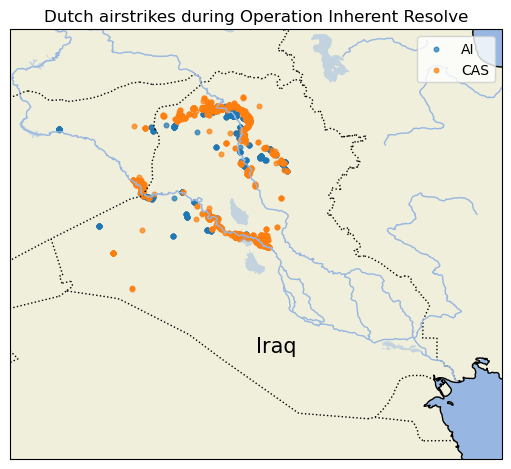

# Analysis on Dutch airstrikes during Operation Inherent Resolve

## Installation
```
conda create -n resolve -f environment.yml
```

## Usage
Run `analysis.py` to see the analysis.

## Results
### Locations
